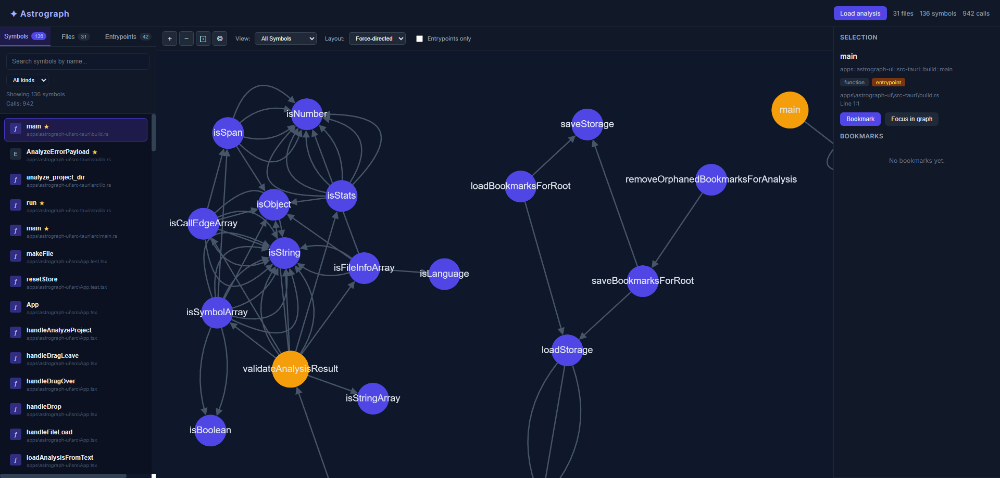

# Astrograph

Astrograph is a lightweight, open-source static code analysis and visualization
tool for exploring large codebases. It generates call graphs, symbol maps, and
entrypoint views from source code and renders them in a local UI.



## Quick start

### Analyze a project (CLI)

```bash
cargo run -p astrograph-cli -- --root /path/to/repo --out analysis.json --cache .astrograph-cache.json
```

The CLI prints a short progress message while it analyzes the project and clearer, user‑friendly
errors if something goes wrong (for example when paths are missing or permissions are denied).

### Run the UI (dev)

```bash
cd apps/astrograph-ui
npm install
npm run dev
```

Then load `analysis.json` in the UI.

### Build the UI

```bash
cd apps/astrograph-ui
npm run build
```

The production build is written to `apps/astrograph-ui/dist`.

### Desktop shell (Tauri)

```bash
cd apps/astrograph-ui
npm run tauri:dev
```

In the desktop app you can use **Analyze project** to pick a directory and run analysis in-app (no CLI needed); results load automatically.

To build a production installer (Windows):

```bash
npm run tauri:build
```

### Tests

```bash
cd apps/astrograph-ui
npm run test:run
npm run test:e2e
```

E2E tests require Playwright browsers:

```bash
npx playwright install
```

## CLI flags

- `--root`: repository root
- `--out`: output JSON path
- `--cache`: cache path for incremental analysis
- `--entrypoint`: mark entrypoints manually (repeatable)
- `--follow-symlinks`: follow symlinks when scanning

## Contributing

We welcome contributions. See [CONTRIBUTING.md](CONTRIBUTING.md) for development setup, code style, testing, and how to submit changes.

## Docs

- `docs/product.md`: product goals, features, and architecture
- `docs/schema.md`: analysis output schema

## Repository layout

```
crates/
  astrograph-engine/   Rust analysis engine
  astrograph-cli/      CLI wrapper for analysis
apps/
  astrograph-ui/       React UI for graphs and bookmarks
docs/
  schema.md            JSON schema reference
```
